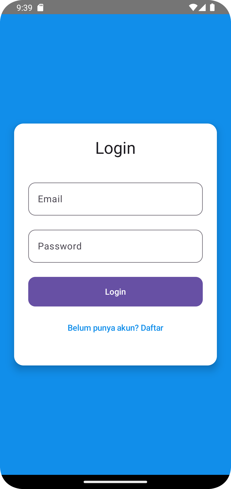
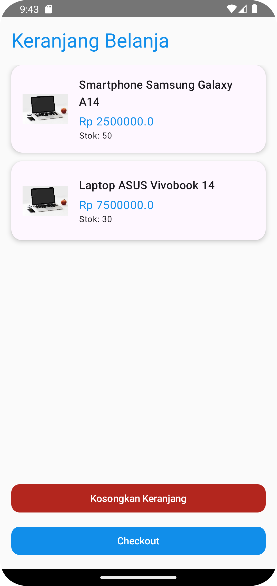

# 📦 Inventori Toko App

**Inventori Toko** adalah aplikasi Android sederhana berbasis **Jetpack Compose** untuk mengelola data produk, melihat detail produk, dan melakukan transaksi sederhana seperti menambah ke keranjang dan checkout.

---
### Nama: Muhammad Rizky Pratama
### NIM: 220320008
### Program Studi: Informatika
### Universitas: Universitas Muhammadiyah Banten

## ✨ Fitur Utama

✅ **Autentikasi Pengguna**
- Register user baru.
- Login user.

✅ **Manajemen Produk**
- Tampilkan daftar produk dari server (API).
- Produk dengan gambar, nama, harga, dan stok.
- Detail produk dengan gambar full, harga & info stok.

✅ **Keranjang Belanja**
- Tambah produk ke keranjang.
- Lihat isi keranjang beserta jumlah item.
- Kosongkan keranjang.
- Checkout keranjang.

✅ **Checkout**
- Menampilkan detail item yang akan dibayar.
- Hitung total harga.
- Simulasikan pembayaran dan clear keranjang.
- Popup pembayaran berhasil.

✅ **UI/UX Modern**
- Jetpack Compose.
- Gambar produk via `Coil`.
- Warna tema yang konsisten.
- Tombol & card dengan Rounded Corner.
- Navigasi menggunakan `NavHost`.

---

## 🗂️ Struktur Navigasi

- **LoginScreen** ➜ Halaman login.
- **RegisterScreen** ➜ Halaman registrasi akun.
- **MainScreen** ➜ Daftar produk + ringkasan keranjang.
- **ProductDetailScreen** ➜ Detail satu produk & tombol tambah ke keranjang.
- **CartScreen** ➜ Tampilkan isi keranjang & tombol checkout.
- **CheckoutScreen** ➜ Rincian checkout + tombol `Bayar Sekarang`.

---

## ⚙️ Teknologi

- Kotlin
- Jetpack Compose
- Coil (Image Loader)
- Navigation Compose
- MVVM (ViewModel)
- PHP REST API (contoh backend)

---

## 📸 Screenshots

Taruh **screenshot app** di folder:

### 📱 Tampilan

**Login**

**Main**

**Detail**

**Keranjang**

**Checkout**

